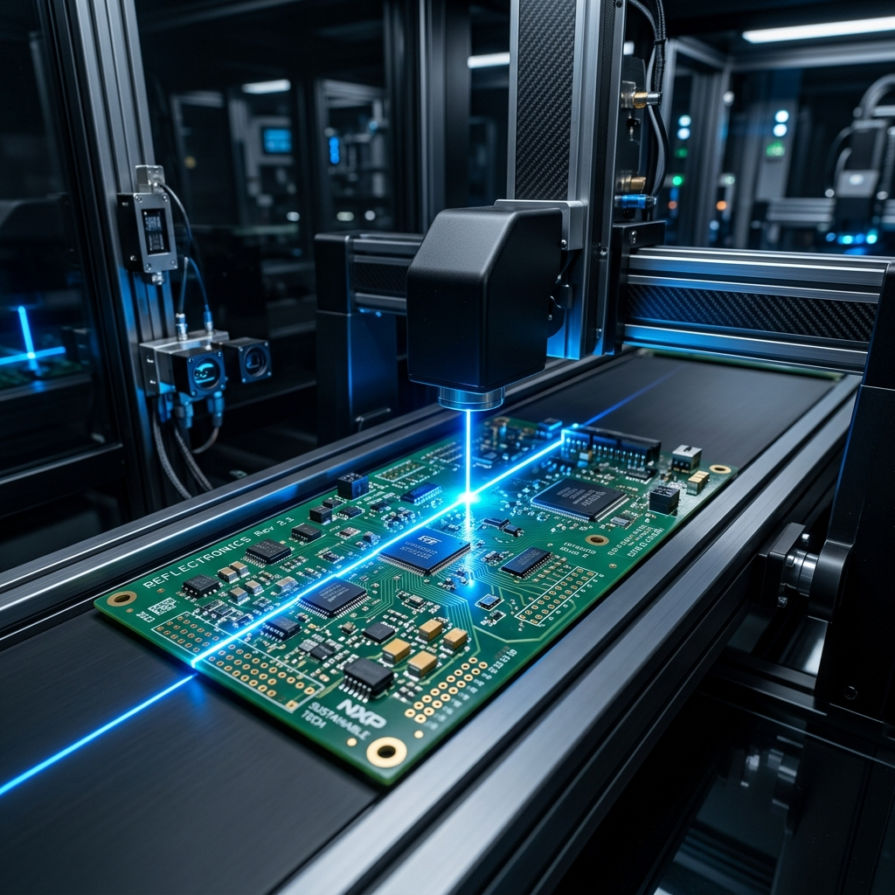
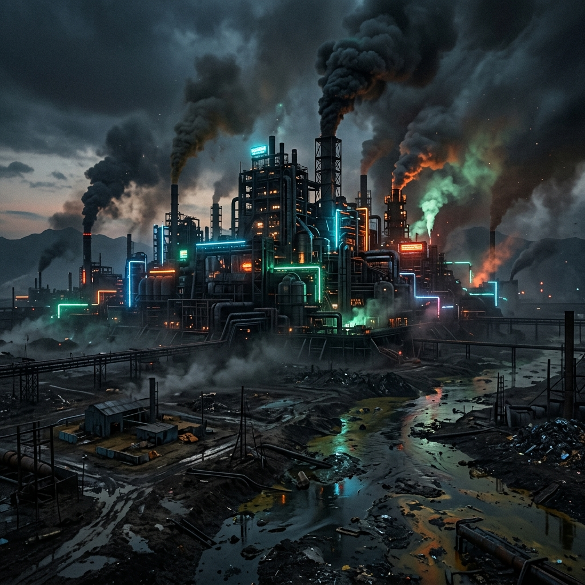
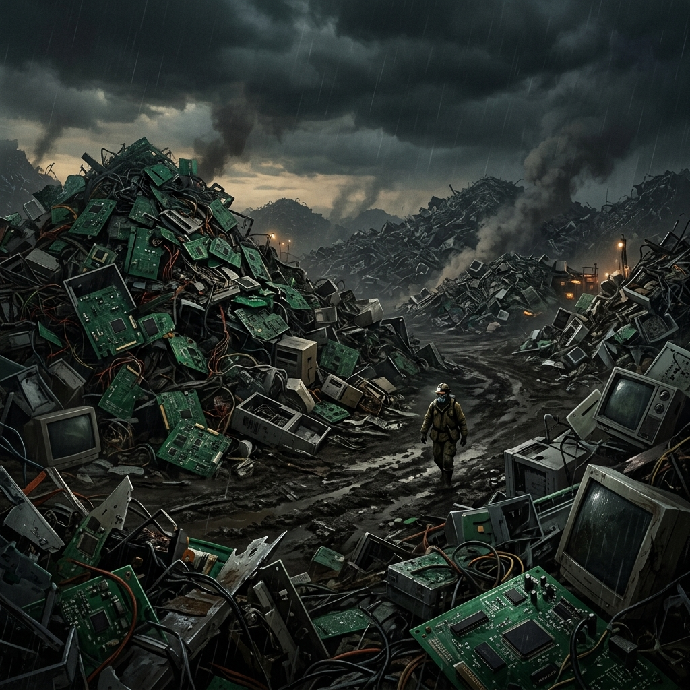

<div align="center">
  

  # SpectraQual: AI-Powered PCB Defect Detection
  
  **Fusion Vision For Flawless Fabrication**

  ### 🌐 [Live Application Demo (Railway)](https://pcb-defect-detection-production.up.railway.app/ui/) 🌐
  
  [](https://fastapi.tiangolo.com/)
  [](https://github.com/ultralytics/ultralytics)
  [](https://opencv.org/)
  [](https://www.python.org/)
  
  <p align="center">
    An end-to-end AI application and interactive web interface that tackles electronic waste through intelligent, early-stage Printed Circuit Board (PCB) defect detection. 
  </p>
</div>

---

## 🌍 The Real-World Impact

Millions of PCBs are wasted due to undetected micro-defects, heavily contributing to the global e-waste crisis. 
By catching manufacturing errors before final assembly, SpectraQual aligns with **UN SDGs 9, 12, and 13**, significantly reducing material waste and industrial energy consumption.

<div align="center">
  
  
</div>

---

## ✨ Key Features

- **YOLOv8 Detection Engine:** Ultra-fast, lightweight inference that highlights PCB micro-defects (like mouse bites, spurs, shorts, open circuits, etc.) instantly.
- **FastAPI Backend:** A robust, high-performance Python backend serving the Deep Learning model and static assets dynamically.
- **Sustainable Interactive UI:** A modern, glassmorphism-themed frontend that tells the environmental story of e-waste and sustainability through interactive galleries and micro-animations.
- **Fully Responsive & Mobile Optimized:** Accessible on any device, gracefully adapting layouts for mobile touch screens and large desktop monitors alike.

## 🛠️ Tech Stack

- **Backend:** Python, FastAPI, Uvicorn, OpenCV, Ultralytics (YOLOv8)
- **Frontend:** Vanilla HTML5, CSS3, JavaScript
- **Deployment:** Docker, Railway
- **Design:** CSS Keyframes, Flexbox/Grid, Dark Mode Aesthetics, Glassmorphism UI

---

## 🚀 Running the Application Locally

1. **Clone the Repository**
   ```bash
   git clone https://github.com/vengateshan-ts/pcb-defect-detection.git
   cd pcb-defect-detection
   ```

2. **Install Dependencies**
   It's highly recommended to use a Docker container, but you can also install directly via pip.
   ```bash
   pip install -r requirements.txt
   ```

3. **Start the FastAPI Server**
   ```bash
   uvicorn app:app --reload
   ```

4. **Access the Interface**
   Open your browser and navigate to: `http://127.0.0.1:8000/ui`

---

## 🧠 How It Works

1. **Upload:** Drag and drop a high-resolution image of a bare PCB onto the inspection engine.
2. **Inference:** The UI sends a `POST` request to the `/predict` FastAPI endpoint.
3. **Detection:** The Ultralytics `.pt` model runs inference, drawing neon boundary boxes around specific anomalies.
4. **Results:** The backend returns a detailed manifest of defects with a Base64 encoded annotated image back to the UI for rendering.

<br>
<div align="center">
  <i>"Transforming Waste Into Intelligence."</i>
</div>
